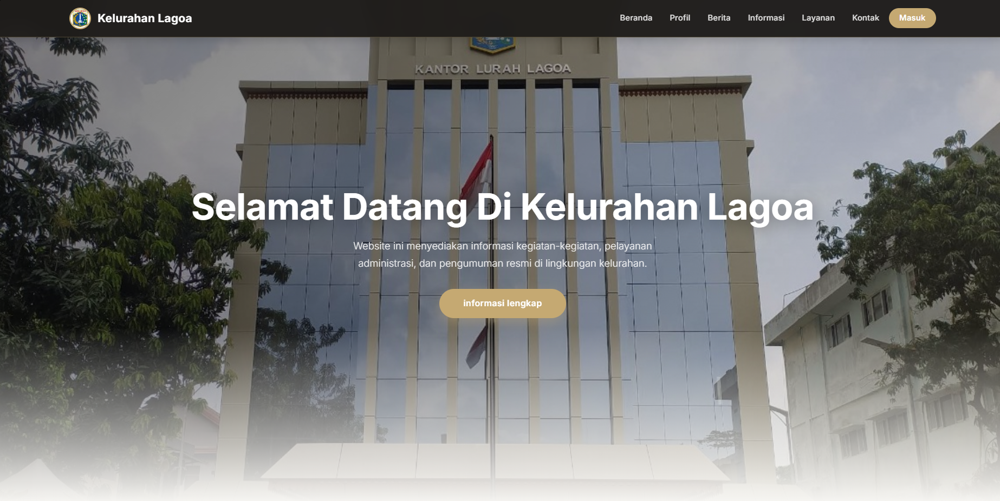

# 🏙️ Digitalisasi Kelurahan — Modern District Template

[](https://developer.mozilla.org/en-US/docs/Web/Guide/HTML/HTML5)
[](https://developer.mozilla.org/en-US/docs/Web/CSS)
[](https://developer.mozilla.org/en-US/docs/Web/JavaScript)
[](https://opensource.org/licenses/MIT)
[](https://github.com/N0tFuhny/Digitalisasi_Kelurahan)

**Digitalisasi Kelurahan** adalah template website modern yang dirancang khusus untuk membantu kantor kelurahan atau desa dalam mendigitalisasi layanan informasi publik mereka. Proyek ini mengutamakan kesederhanaan, aksesibilitas, dan kecepatan dalam implementasi.

---

## 🚀 Demo / Live Preview

Lihat template yang sudah berjalan di sini:
👉 **[Lihat Demo Website](https://n0tfuhny.github.io/Digitalisasi_Kelurahan/)**

---

## 📸 Tampilan Proyek



---

## ✨ Fitur Utama

### 🏢 Website Publik
- **Halaman Landas Modern:** Navigasi yang bersih dengan desain bertema profesional.
- **Profil & Sejarah:** Bagian khusus untuk memperkenalkan sejarah dan profil kelurahan.
- **Daftar Layanan Publik:** Informasi lengkap mengenai pengurusan administrasi (KTP, SKTM, dll).
- **Portal Berita:** Halaman berita terkini untuk warga.
- **Kegiatan Masyarakat:** Daftar kegiatan mendatang dengan sistem filter berdasarkan tanggal dan lokasi.
- **Integrasi Google Maps:** Lokasi kantor kelurahan yang tertanam langsung di halaman kontak.
- **Desain Responsif:** Optimal untuk diakses melalui smartphone, tablet, maupun desktop.

### 🔐 Sistem Admin
- **Login Admin:** Akses terbatas untuk pengelola konten.
- **Dashboard Sederhana:** Antarmuka yang mudah digunakan untuk mengelola data website.
- **Manajemen Konten:** Tambah dan hapus berita atau kegiatan masyarakat dengan mudah.
- **Upload Gambar:** Mendukung unggah foto untuk setiap kegiatan atau berita.
- **Live Preview Editing:** Perubahan data dapat langsung dilihat pada sisi publik (menggunakan localStorage).

---

## 🛠️ Tech Stack

- **Struktur:** HTML5 (Semantik & Modern)
- **Gaya:** Vanilla CSS3 (Custom Design System)
- **Logika:** Vanilla JavaScript (ES6+)
- **Ikon:** [Feather Icons](https://feathericons.com/)
- **Penyimpanan:** Browser LocalStorage (untuk kebutuhan demo saja!)

---

## 📂 Struktur Proyek

```text
Digitalisasi_Kelurahan/
├── index.html              # Halaman Beranda & Profil
├── informasi.html          # Halaman Daftar Kegiatan
├── berita.html             # Halaman Berita Kelurahan
├── layanan.html            # Halaman Informasi Layanan Publik
├── login.html              # Halaman Masuk Admin
├── admin-dashboard.html    # Dashboard Pengelolaan Konten
│
├── css/
│   ├── style.css           # Styling Utama & Layout
│   └── login.css           # Styling Khusus Halaman Login
│
├── js/
│   ├── config.js           # Konfigurasi Utama (Nama, Logo, Kontak)
│   ├── script.js           # Logika Umum & Injeksi Data
│   ├── informasi.js        # Logika Halaman Kegiatan
│   ├── berita.js           # Logika Halaman Berita
│   └── admin.js            # Logika Dashboard Admin
│
├── img/                    # Asset Gambar & Logo
└── README.md               # Dokumentasi Proyek
```

---

## ⚙️ Panduan Konfigurasi

Semua pengaturan utama website dapat diubah melalui file:
`js/config.js`

Di dalam file ini, Anda dapat menyesuaikan:
- Nama Kelurahan & Logo
- Deskripsi *Hero Section*
- Konten Sejarah / Profil
- Detail Kontak (Alamat, Email, Telepon)
- Link Media Sosial (Instagram, Facebook, Twitter)
- URL Embed Google Maps
- Daftar Layanan Administrasi

---

## 🏁 Memulai (Getting Started)

### 1. Clone Repository
```bash
git clone https://github.com/N0tFuhny/Digitalisasi_Kelurahan.git
cd Digitalisasi_Kelurahan
```

### 2. Jalankan Proyek
Cukup buka file `index.html` pada browser favorit Anda. Tidak diperlukan instalasi server atau database.

### 3. Akses Admin
Untuk masuk ke dashboard pengelolaan, gunakan kredensial berikut:
- **Username:** `admin`
- **Password:** `123`

---

## ⚠️ Sistem Penyimpanan

Template ini menggunakan localStorage pada browser sebagai simulasi database.

Untuk penggunaan produksi (website yang benar-benar digunakan secara online),
disarankan untuk menghubungkan sistem admin dengan backend atau database seperti:

- MySQL
- Firebase
- Supabase
- PostgreSQL

Implementasi saat ini hanya mensimulasikan perilaku database
agar template mudah dipreview dan dikustomisasi.

---

## 📌 Catatan Penting
- Proyek ini sepenuhnya berbasis **Frontend**.
- Penyimpanan data dinamis (berita/kegiatan) menggunakan **localStorage** pada browser. Data akan hilang jika cache browser dibersihkan atau dibuka di device berbeda.
- Sangat cocok untuk tujuan pembelajaran, prototipe pemerintahan desa, atau proyek akademik.

---

## 🎯 Tujuan Proyek
Proyek ini dibuat untuk menjembatani kesenjangan digital di tingkat lokal, memberikan solusi website yang cepat, murah, dan mudah dikelola tanpa memerlukan infrastruktur server yang kompleks.

---

## 👨‍💻 Author
**Fuhny** — [GitHub Profile](https://github.com/N0tFuhny)

---

## 📄 Lisensi
Proyek ini dilisensikan di bawah [MIT License](LICENSE).

---

## ⭐ Dukung Proyek Ini
Jika template ini bermanfaat bagi Anda, jangan lupa berikan **Star** pada repository ini sebagai bentuk dukungan! Terima kasih.
